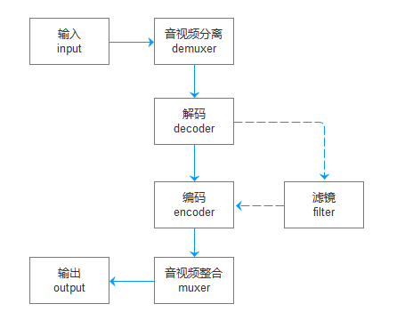

[toc]

## ffmpeg入门指南
ffmpeg是音视频处理方面的瑞士军刀，目前市面上几乎所有的音视频工具，都与ffmpeg脱不了关系。我们在音视频处理或开发工作时，有ffmpeg这个工具，能够帮我们解决大部分的问题，或是在我们的应用里集成ffmpeg，将能够拥有非常强大的音视频处理能力，而ffmpeg或是说音视频方面的水非常的深，需要学习的知识点太多太多，光ffmpeg命令行的文档，就有3万行左右，还不是完全版的，还有音视频方面，也有大量的知识点需要去了解，完全不下于ffmpeg本身。总的来说，学习曲线相当陡峭。

本文档旨在于说明ffmpeg的一般过程、基础的架构，让大家能够掌握ffmpeg的学习与使用的方法。

### 基础概念
1. 编码codec：是对于原始的音视频的数字表示方式，通常是无压缩形式的，或是无结构的。
2. 封装格式format：可能会对原始的音视频进行压缩（有损或无损），并且有很明确的包结构，用于描述音视频的元信息。

### 框架图


ffmpeg一般完成音频或视频的转码或是处理的事情，它可以同时支持多个输入，也可以支持多个输出，在输入与输出之中，完成一些你想要做的事情，比如转码、加视频滤镜、音视频分离、整合等等的事情。下面说明一下ffmpeg在上面框图上每一步可能会做的事情。

1. 读取输入：ffmpeg一般会通过输入的形式，去猜解输入数据源的封装形式，数据编码等。普通文件，可能会通过文件后缀名进行猜测封装形式，也肯定会对数据内容直接进行猜测，但这是对于普通的比较知名的封装形式而言，但是对于PCM音频类的就不奏效了，音频通常是无封装形式的，是裸数据，这个时候，我们通常需要声明format，比如-f s16le。在声明输入参数时，一定要想办法让ffmpeg知道，将要读取的数据源，它是什么封装形式的。应该会在这一步上完成解封装的过程。
2. 音视频分离：对于比如mp4这一类的封装媒体文件，它是一个输入，同时具备音频和视频的，它将在接下来的处理流程上，分为多个stream，在ffmpeg的输出上可以看到Input #n下的Stream #n:m，这就是分离出来的各个流，然后接下来是我们要对这每一个stream进行处理，比如转码等。
3. 解码：如果我们有需要进行音视频处理，比如为音频增加回声，那么将可能会在这一个环节上，完成从封装格式到原始音视频数据解码的过程，为接下来的音频滤镜处理提供数据支持。
4. 滤镜处理：在这一环节上，可以对每一个流进行处理，比如音频可以增加回声，视频可以增加图像处理滤镜等。
4. 编码：可能会在这一步进行A编码到B编码的转换过程。
5. 音视频整合：在这一步完成流的合并的过程。
6. 输出：ffmpeg的输出十分的强大，它跟输入差不多，输出需要声明封装形式，输出的目标，可以是一个或是多个，然后可以是文件、stdout、网络协议等等等等。

> 在上面各环节里，ffmpeg所支持的比如demuxer、encoder、format、协议等都有哪些，可以通过ffmpeg -xxxxs来查看，比如我们看有哪些支持的codec，可以在命令行里输入ffmpeg -codecs，一般输出如下：我们来学习一下如何理解这个输出形式：

```plaintext
Codecs:
 D..... = Decoding supported
 .E.... = Encoding supported
 ..V... = Video codec
 ..A... = Audio codec
 ..S... = Subtitle codec
 ...I.. = Intra frame-only codec
 ....L. = Lossy compression
 .....S = Lossless compression
 -------
 D.VI.S 012v                 Uncompressed 4:2:2 10-bit
 D.V.L. 4xm                  4X Movie
 D.VI.S 8bps                 QuickTime 8BPS video
 .EVIL. a64_multi            Multicolor charset for Commodore 64 (encoders: a64multi )
 .EVIL. a64_multi5           Multicolor charset for Commodore 64, extended with 5th color (colram) (encoders: a64multi5 )
```

在下边输出的第一行里，我们分为三列，第一列为codec的特性编码，第二列为codec名称，第三列为codec的详细说明。然后上边的第一大段落，说明了codec特性编码的含义，D表示解码支持、E表示解码支持，V/A/S表示是音频还是视频或字幕，I表示仅I祯支持，L表示有损压缩，S表示无损压缩。第一列是为了让我们能够快速找到所需要的codec而准备的，知道了这一点，那么我们就可以通过`ffmpeg -codecs | grep DEV..S`，来找到支持视频编解码的无损压缩codec了。对于其它的比如`ffmpeg -formats`、`ffmpeg -protocols`等形式的支持特性的搜索，也是一样的道理。

### codec编码器
这一块不细说了，自己通过`ffmpeg -codecs`查看即可，可以说，ffmpeg支持几乎所有音视频的编解码，非常的全面。

### format封装格式
这一块也不细说了，自己通过`ffmpeg -formats`查看即可。

### protocol协议支持
ffmpeg支持从网络协议上读取或输出它的处理结果，比如`ffmpeg -f mp4 -i tcp://192.168.0.123:111 ...`，它将创建TCP连接到目标服务器的指定端口，并读取需要处理的数据。

输入支持：async、cache、concat、crypto、data、ffrtmpcrypt、ffrtmphttp、file、ftp、gopher、hls、http、httpproxy、https、mmsh、mmst、pipe、rtmp、rtmpe、rtmps、rtmpt、rtmpte、rtmpts、rtp、sctp、srtp、subfile、tcp、tls、udp、udplite、unix、srt。

输出支持：crypto、ffrtmpcrypt、ffrtmphttp、file、ftp、gopher、http、httpproxy、https、icecast、md5、pipe、prompeg、rtmp、rtmpe、rtmps、rtmpt、rtmpte、rtmpts、rtp、sctp、srtp、tee、tcp、tls、udp、udplite、unix、srt

### filter滤镜支持
ffmpeg支持对输入的音频或视频进行各种各样的处理或变换，比如对音频增加回声等，大家可以通过`ffmpeg -filters`来查看其所支持的滤镜，以及各滤镜的说明与用途。

## 命令行剖析
```plaintext
ffmpeg
    -f h264 -i video.h264                   # 从video.h264文件中读取，封装形式为h264
    -f s16le -ar 8000 -ac 1 -i audio.pcm    # 从audio.pcm文件中读取，PCM_S16LE编码，8000采样，单声道
    
    -vcodec copy                            # 视频编码直接复制
    -acodec aac                             # 音频编码为AAC
    -f flv                                  # 封装形式flv
    output.flv                              # 输出至目标文件output.flv中去
```
ffmpeg使用参数`-i`来标识输入源，输出没有前置参数，在输入前的参数是用于描述输入的，在输出前的参数是为了修饰输出要求的，所以比如我们要从TCP连接中或是从stdin中读取数据时，一般需要明确声明输入的数据封装形式，比如：`ffmpeg -f h264 -i tcp://localhost:1234...`。


## 其它
### 设备
### ffplay
### ffprobe